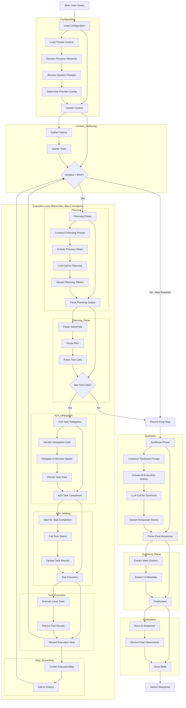

# PES Agent Concept Document

## Overview

The PES (Plan-Execute-Synthesize) Agent is a core component of the ART framework that implements a structured approach to AI agent orchestration. Starting from v0.3.9, it follows a **ReAct-like iterative loop** model that separates planning, execution, and response synthesis to create more reliable and explainable AI interactions. The agent can now iterate multiple times (up to 5) to refine its plan based on tool execution results.

## Key Components and Their Roles

### 1. PESAgent Class
The main orchestrator that implements the IAgentCore interface. It coordinates all phases of the agent execution cycle.

### 2. Dependencies
The PESAgent relies on several key dependencies that are injected at initialization:
- **StateManager**: Manages thread configuration and state
- **ConversationManager**: Handles conversation history
- **ToolRegistry**: Manages available tools
- **ReasoningEngine**: Interfaces with LLM providers
- **OutputParser**: Parses LLM responses
- **ObservationManager**: Records execution events
- **ToolSystem**: Orchestrates tool execution
- **UISystem**: Provides UI communication sockets
- **A2ATaskRepository**: Manages Agent-to-Agent tasks
- **AgentDiscoveryService**: Discovers remote agents (optional)
- **TaskDelegationService**: Delegates tasks to remote agents (optional)
- **SystemPromptResolver**: Resolves system prompt hierarchy
- **Persona**: Optional agent persona defining name and stage-specific prompts

Note: As of v0.3.9, the PromptManager dependency has been removed. The PESAgent now constructs prompts directly as `ArtStandardPrompt` objects.

### 3. Agent Persona
Defines the identity and guidance for the agent with separate prompts for planning and synthesis phases.

## Workflow of the PES Agent

The PES agent follows a structured workflow with a **ReAct-like iterative loop** (v0.3.9+):

### Phase 1: Configuration Loading
- Loads thread context and configuration
- Resolves persona hierarchy (call → thread → instance)
- Resolves system prompts through the hierarchy for both planning and synthesis stages
- Determines runtime provider configuration

### Phase 2: Context Gathering
- Retrieves conversation history based on thread configuration
- Gathers available tools for the current thread

### Phase 3: Execution Loop (ReAct-like)

The agent now executes an iterative loop (max 5 iterations) that allows it to refine its plan based on tool execution results:

**For each iteration:**

1. **Planning**
   - Constructs a planning prompt with:
     - System prompt guidance
     - Conversation history
     - Available tools (including virtual delegation tool)
     - Agent delegation context
     - **Previous execution steps** (tool results, A2A task results from prior iterations)
   - Calls the LLM for planning
   - Parses the planning output to extract:
     - Thread title
     - User intent
     - Execution plan
     - Tool calls
   - Records observations for each planning element

2. **A2A Task Delegation** (if tool calls present)
   - Identifies delegation tool calls in the plan
   - Delegates tasks to remote agents through the A2A system
   - Persists task information in the repository

3. **A2A Task Completion Waiting** (if A2A tasks were delegated)
   - Waits for delegated tasks to complete with configurable timeout (default 30s)
   - Polls task status periodically (default 2s)
   - Updates task information with results

4. **Tool Execution** (if local tool calls present)
   - Executes local tool calls identified in the planning phase
   - Records tool execution results and errors
   - Tool errors no longer halt execution; results (including errors) are fed to next iteration

5. **Observation Recording**
   - Records the execution step including:
     - Iteration number
     - Planning output
     - Tool results
     - A2A task results
     - Planning context

**Loop Termination Conditions:**
- No tool calls were identified in the planning phase
- Maximum iterations (5) reached

### Phase 4: Synthesis
- Constructs a synthesis prompt with:
  - System prompt guidance
  - Conversation history
  - **Complete execution history from all iterations**
- Calls the LLM for final response generation
- Parses the final response to extract:
  - Main content
  - UI metadata (sources, suggestions)
- Records synthesis observations

### Phase 5: Finalization
- Saves the final AI response message
- Records the final response observation
- Saves state if modified

### ExecutionStep Interface

Each iteration is tracked via an `ExecutionStep` object:

```typescript
interface ExecutionStep {
    iteration: number;
    planningOutput: {
        title?: string;
        intent?: string;
        plan?: any;
        toolCalls?: ParsedToolCall[];
        thoughts?: string;
    };
    toolResults: ToolResult[];
    a2aTasks: A2ATask[];
    planningContext?: {
        toolsList: { name: string; description?: string }[];
        a2aSummary: string;
        plannedToolCalls: ParsedToolCall[];
        rawPlanningText?: string;
    };
}
```

## Statement Features and Developer Usage

### 1. System Prompt Hierarchy
Developers can customize agent behavior through a three-level system prompt hierarchy:
- **Instance Level**: Default prompts defined when creating the ART instance
- **Thread Level**: Thread-specific prompts that override instance defaults
- **Call Level**: Per-call prompts that override thread and instance defaults

Usage:
```typescript
import { createArtInstance } from 'art-framework';
import type { ArtInstanceConfig } from 'art-framework';

// Instance level (in ArtInstanceConfig)
const config: ArtInstanceConfig = {
  storage: { type: 'memory' },
  providers: {
    // Your provider configuration
  },
  persona: {
    name: "CustomAgent",
    prompts: {
      planning: "You are a specialized planning assistant...",
      synthesis: "You are a specialized synthesis assistant..."
    }
  }
};

const art = await createArtInstance(config);

// Thread level
await art.stateManager.setThreadConfig(threadId, {
  providerConfig: {
    // Your provider configuration
  },
  enabledTools: [],
  historyLimit: 10,
  persona: {
    name: "ThreadAgent",
    prompts: {
      planning: "You are a thread-specific planning assistant...",
      synthesis: "You are a thread-specific synthesis assistant..."
    }
  }
});

// Call level
const response = await art.process({
  query: "What is the weather today?",
  threadId: "thread-123",
  options: {
    persona: {
      name: "CallAgent",
      prompts: {
        planning: "You are a call-specific planning assistant...",
        synthesis: "You are a call-specific synthesis assistant..."
      }
    }
  }
});
```

### 2. Observation System
The PES agent records detailed observations throughout execution:
- INTENT: User intent identified during planning
- TITLE: Thread title generated during planning
- PLAN: Execution plan generated during planning
- THOUGHTS: Internal reasoning during LLM calls
- TOOL_CALL: Tool calls identified in the plan
- TOOL_EXECUTION: Results of tool executions
- SYNTHESIS: Events during response synthesis
- ERROR: Any errors encountered
- FINAL_RESPONSE: The final AI response
- STATE_UPDATE: Changes to agent state
- LLM_STREAM_*: Events related to LLM streaming

Usage:
```typescript
import { ObservationType } from 'art-framework';

// Subscribe to observations
const unsubscribe = art.uiSystem.getObservationSocket().subscribe(
  (observation) => {
    console.log(`Observation: ${observation.type}`, observation.content);
  },
  [ObservationType.TITLE, ObservationType.INTENT, ObservationType.PLAN],
  { threadId: "thread-123" }
);
```

### 3. Streaming Support
The PES agent supports streaming responses with detailed token typing:
- AGENT_THOUGHT_LLM_THINKING: Planning phase thinking tokens
- AGENT_THOUGHT_LLM_RESPONSE: Planning phase response tokens
- FINAL_SYNTHESIS_LLM_THINKING: Synthesis phase thinking tokens
- FINAL_SYNTHESIS_LLM_RESPONSE: Synthesis phase response tokens

Usage:
```typescript
// Subscribe to LLM stream events
const unsubscribe = art.uiSystem.getLLMStreamSocket().subscribe(
  (event) => {
    if (event.type === 'TOKEN') {
      switch (event.tokenType) {
        case 'FINAL_SYNTHESIS_LLM_RESPONSE':
          // Add token to final response display
          addToResponseDisplay(event.data);
          break;
        case 'AGENT_THOUGHT_LLM_THINKING':
          // Show planning thoughts
          showPlanningThoughts(event.data);
          break;
      }
    }
  },
  undefined,
  { threadId: "thread-123" }
);
```

### 4. A2A (Agent-to-Agent) Task System
The PES agent supports delegating tasks to remote agents:
- Automatic agent discovery based on task type
- Task delegation with persistence
- Asynchronous task completion waiting
- Result integration in synthesis

Usage:
```typescript
import type { ArtInstanceConfig } from 'art-framework';

// The agent automatically discovers and delegates to remote agents
// Developers can configure the A2A system at the instance level
const config: ArtInstanceConfig = {
  storage: { type: 'memory' },
  providers: {
    // Your provider configuration
  },
  a2aConfig: {
    discoveryEndpoint: "https://a2a-discovery.example.com",
    callbackUrl: "https://myapp.example.com/a2a-callback"
  }
};

const art = await createArtInstance(config);
```

### 5. Tool System Integration
The PES agent seamlessly integrates with the ART tool system:
- Automatic tool discovery for threads
- Tool call planning and execution
- Result integration in synthesis
- Error handling and partial success support

Usage:
```typescript
import { IToolExecutor } from 'art-framework';
import type { ToolSchema, ToolResult, ExecutionContext } from 'art-framework';

// Register custom tools
class CustomTool implements IToolExecutor {
  readonly schema: ToolSchema = {
    name: "custom_tool",
    description: "A custom tool that does something useful",
    inputSchema: {
      type: "object",
      properties: {
        param1: { type: "string", description: "First parameter" },
        param2: { type: "number", description: "Second parameter" }
      },
      required: ["param1"]
    }
  };

  async execute(input: any, context: ExecutionContext): Promise<ToolResult> {
    // Implementation
    return {
      callId: "call-id",
      toolName: this.schema.name,
      status: "success",
      output: { result: "Custom tool executed successfully" }
    };
  }
}

// Register tool when creating ART instance
const config: ArtInstanceConfig = {
  storage: { type: 'memory' },
  providers: {
    // Your provider configuration
  },
  tools: [new CustomTool()]
};

const art = await createArtInstance(config);
```

## When to Use Different Features

### System Prompt Customization
- Use instance-level prompts for application-wide agent behavior
- Use thread-level prompts for conversation-specific behavior
- Use call-level prompts for dynamic behavior based on user input

### Observation System
- Use TITLE observations for updating conversation titles in UI
- Use INTENT observations for showing user intent
- Use PLAN observations for displaying execution steps
- Use THOUGHTS observations for showing agent reasoning
- Use ERROR observations for error handling and debugging

### Streaming
- Use streaming for real-time user feedback during long operations
- Use token typing to differentiate between planning and synthesis phases
- Use thinking tokens to show agent's internal reasoning process

### A2A Task System
- Use when specialized agents can better handle specific subtasks
- Use when you need to distribute workload across multiple agents
- Use when you want to leverage pre-trained specialized models

### Tool System
- Use for extending agent capabilities with custom functionality
- Use for integrating with external APIs and services
- Use for implementing domain-specific logic

## Workflow Flowchart



The PES agent provides a robust, extensible framework for building AI applications with clear separation of concerns, detailed observability, iterative refinement through ReAct-like loops, and support for both local and distributed agent architectures.