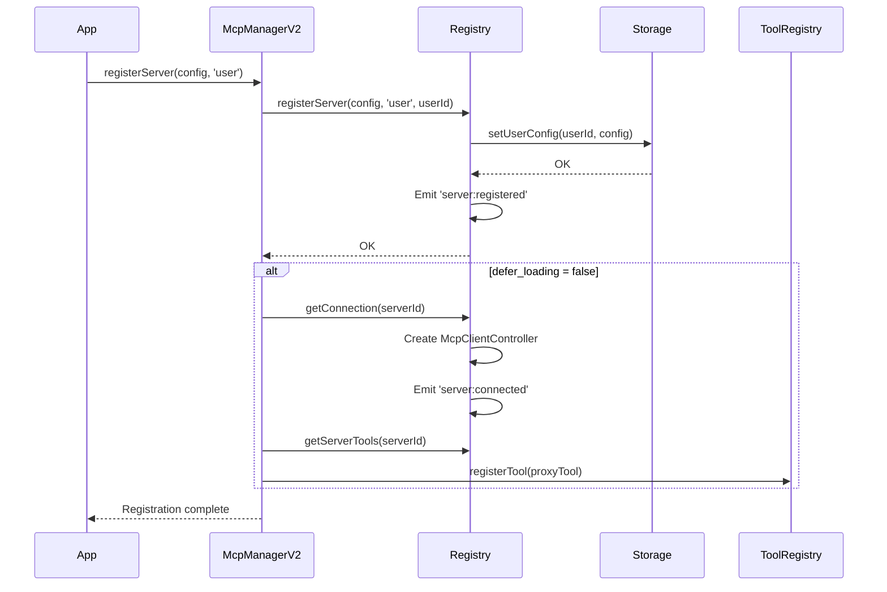
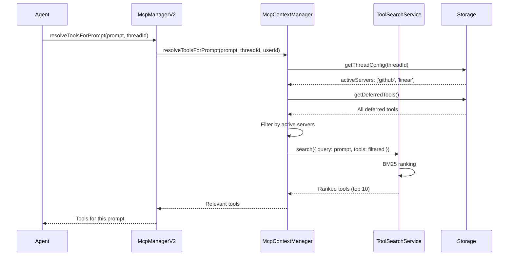
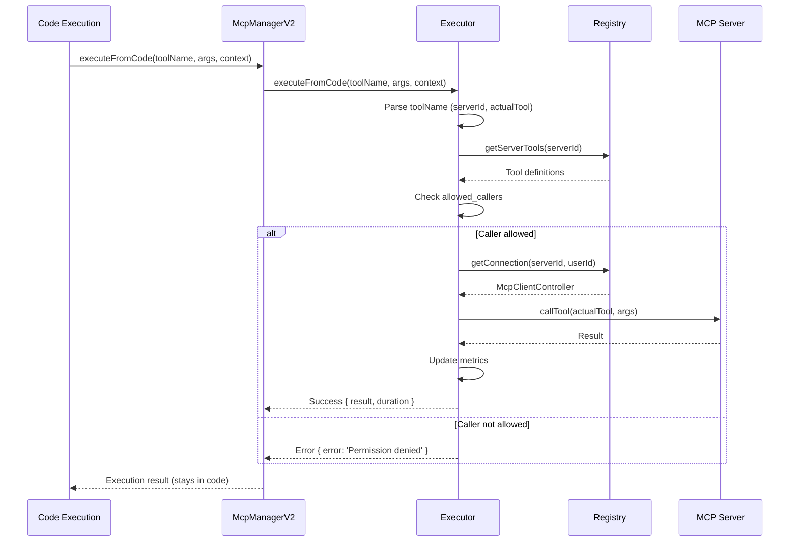
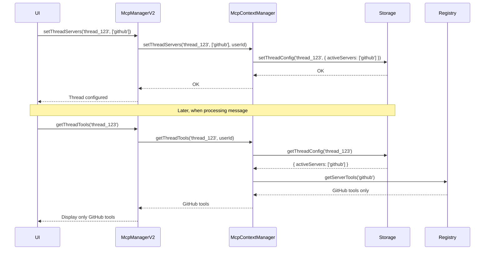

# MCP System Architecture Guide

**Version**: 2.0
**Status**: Stable
**Last Updated**: 2025-01-30

## Table of Contents

- [Overview](#overview)
- [Architecture Layers](#architecture-layers)
- [Component Details](#component-details)
- [Data Flow](#data-flow)
- [Key Patterns](#key-patterns)
- [Integration](#integration)
- [Configuration](#configuration)
- [Security](#security)

## Overview

The ART Framework's MCP (Model Context Protocol) system enables browser-based AI agents to connect to external tool servers dynamically. Version 2.0 implements Anthropic's advanced tool use patterns for optimal performance and token efficiency.

### Design Goals

1. **Zero Hardcoded Configuration**: All MCP servers configured dynamically at runtime
2. **Multi-Tenant Isolation**: Per-user configuration with secure credential storage
3. **Thread-Specific Control**: Different tools for different conversations
4. **Optimal Token Usage**: 85% reduction via Tool Search pattern
5. **Browser-Friendly**: HTTP/WebSocket only, no stdio or node processes
6. **Developer Experience**: Simple, intuitive APIs with TypeScript support

### Key Improvements Over V1

| Feature | V1 (McpManager) | V2 (McpManagerV2) |
|---------|-----------------|-------------------|
| **Storage** | localStorage (single global key) | IndexedDB (multi-tenant) |
| **Server Registration** | Static at startup | Dynamic at runtime |
| **Thread Control** | All tools in all threads | Thread-specific activation |
| **Tool Loading** | Upfront (all tools) | On-demand (Tool Search) |
| **Token Efficiency** | Baseline | 85% reduction |
| **User Isolation** | None | Per-user with encryption |
| **CORS Solution** | Browser extension | Edge function (optional) |

## Architecture Layers

The MCP system is organized into 5 architectural layers:

```
┌─────────────────────────────────────────────────────────┐
│                   Application Layer                     │
│              (Agent, ToolRegistry, UI)                  │
└────────────────┬────────────────────────────────────────┘
                 │
┌────────────────▼────────────────────────────────────────┐
│                 McpManagerV2 (Facade)                   │
│  - Unified API for all MCP operations                  │
│  - Lifecycle management                                 │
│  - CORS proxy integration                               │
└────┬───────┬────────┬────────┬────────┬─────────────────┘
     │       │        │        │        │
     │       │        │        │        │
┌────▼───┐ ┌▼──────┐ ┌▼──────┐ ┌▼─────┐ ┌▼──────────────┐
│Storage │ │Registry│ │Context│ │Search│ │ Executor      │
│Layer   │ │Layer   │ │Layer  │ │Layer │ │ Layer         │
└────┬───┘ └┬──────┘ └┬──────┘ └┬─────┘ └┬──────────────┘
     │      │         │         │        │
     │      │         │         │        │
┌────▼──────▼─────────▼─────────▼────────▼───────────────┐
│              MCP Client Controllers                     │
│         (HTTP/WebSocket connections)                    │
└─────────────────────────────────────────────────────────┘
```

### Layer 1: Storage Layer

**Purpose**: Multi-tenant data persistence with per-user isolation

**Components**:
- `IndexedDBMcpStorage`: Browser-native storage adapter
- 5 Object Stores:
  - `app_config`: App-level server configurations
  - `user_configs`: Per-user server configurations
  - `thread_configs`: Thread-specific server activation
  - `credentials`: Encrypted OAuth tokens (per user+server)
  - `deferred_tools`: Tool metadata for search

**Key Features**:
- Automatic schema migrations
- Fast indexed lookups
- Export/import functionality
- Secure credential encryption

**Location**: `src/systems/mcp/storage/`

### Layer 2: Registry Layer

**Purpose**: Dynamic server lifecycle and connection management

**Components**:
- `McpRegistry`: Central registry for all MCP servers
- Event-driven architecture (EventEmitter)
- Connection pooling with health checks
- Server status tracking

**Key Features**:
- Register/unregister servers at runtime
- Automatic connection retry with backoff
- Health monitoring and metrics
- Event notifications (server:connected, tool:loaded, etc.)

**Location**: `src/systems/mcp/registry/`

**Events**:
```typescript
registry.on('server:registered', ({ serverId, scope }) => { ... });
registry.on('server:connected', ({ serverId }) => { ... });
registry.on('tool:loaded', ({ toolKey, serverId }) => { ... });
```

### Layer 3: Context Layer

**Purpose**: Thread and call-level tool activation control

**Components**:
- `McpContextManager`: Thread-specific tool resolution
- Configuration inheritance (app → user → thread)
- Automatic tool search integration

**Key Features**:
- Activate specific servers per thread
- Automatic tool discovery per prompt
- Configuration overrides
- Thread isolation

**Location**: `src/systems/mcp/context/`

**Example**:
```typescript
// Only use GitHub tools in this thread
await contextManager.setThreadServers('thread_123', ['github']);

// Auto-resolve tools for prompt
const tools = await contextManager.resolveToolsForPrompt(
  'Create a PR to fix the bug',
  'thread_123',
  'user_456'
);
```

### Layer 4: Search Layer

**Purpose**: Intelligent tool discovery and ranking

**Components**:
- `ToolSearchService`: Multi-strategy search
- Strategies:
  - **Regex**: Fast keyword matching
  - **BM25**: Sophisticated ranking (default)
  - **Semantic**: Embedding-based (future)

**Key Features**:
- 85% token reduction (55K → 8.7K tokens)
- Relevance scoring
- Configurable thresholds
- Extensible strategy pattern

**Location**: `src/systems/mcp/search/`

**BM25 Algorithm**:
```
score = Σ IDF(term) × (TF(term) × (k1 + 1)) / (TF(term) + k1 × (1 - b + b × (|D| / avgdl)))

Where:
- IDF = Inverse Document Frequency
- TF = Term Frequency
- k1 = 1.5 (term saturation)
- b = 0.75 (length normalization)
- |D| = document length
- avgdl = average document length
```

### Layer 5: Executor Layer

**Purpose**: Programmatic tool execution from code environment

**Components**:
- `ProgrammaticToolExecutor`: Code-based tool orchestration
- Permission validation (allowed_callers)
- Execution metrics tracking

**Key Features**:
- 37% token savings (results in code, not context)
- Parallel execution support
- Sequential execution with dependencies
- Permission checks

**Location**: `src/systems/mcp/executor/`

**Example**:
```typescript
// Execute tool from code (result doesn't enter Claude's context)
const result = await executor.executeFromCode(
  'mcp_github_createPullRequest',
  { title: 'Fix bug', base: 'main', head: 'fix-123' },
  {
    caller: { type: 'code_execution_20250825', tool_id: 'exec_123' },
    userId: 'user_456',
    threadId: 'thread_789'
  }
);
```

## Component Details

### McpManagerV2

The main facade providing a unified API for all MCP operations.

**Responsibilities**:
- Initialize all layers
- Coordinate between layers
- Provide simple API surface
- Handle CORS proxy integration
- Legacy compatibility

**Key Methods**:

```typescript
class McpManagerV2 {
  // Initialization
  async initialize(config: McpManagerV2Config): Promise<void>

  // Server Management
  async registerServer(server: McpServerConfig, scope: 'app' | 'user'): Promise<void>
  async unregisterServer(serverId: string, scope: 'app' | 'user'): Promise<void>

  // Thread Control
  async setThreadServers(threadId: string, serverIds: string[]): Promise<void>
  async getThreadTools(threadId: string): Promise<McpToolDefinition[]>

  // Tool Search
  async resolveToolsForPrompt(
    prompt: string,
    threadId: string,
    options?: SearchOptions
  ): Promise<McpToolDefinition[]>

  // Programmatic Execution
  async executeFromCode(
    toolName: string,
    args: any,
    context: ExecutionContext
  ): Promise<ExecutionResult>

  // Connection Management
  async getOrCreateConnection(serverId: string): Promise<McpClientController>

  // Lifecycle
  async shutdown(): Promise<void>
}
```

### McpProxyTool (Enhanced)

Wrapper for MCP tools implementing Anthropic's advanced patterns.

**New Features**:
- `defer_loading`: Lazy tool initialization
- `allowed_callers`: Permission checks for code execution
- `input_examples`: Example inputs in schema
- `whenToUse`: Usage guidance
- Extended metadata (tags, estimatedCost)

**Example Schema**:
```typescript
{
  name: 'mcp_github_createPullRequest',
  description: 'Create a new pull request on GitHub',
  inputSchema: { /* JSON Schema */ },

  // Anthropic Patterns
  whenToUse: 'When user wants to create a PR after code changes',
  input_examples: [
    { title: 'Fix bug', base: 'main', head: 'fix-123' }
  ],
  allowed_callers: ['code_execution_20250825'],
  defer_loading: true,
  tags: ['github', 'git', 'pr'],
  estimatedCost: 0.0001
}
```

## Data Flow

### 1. Server Registration Flow



### 2. Tool Search Flow



### 3. Programmatic Execution Flow



### 4. Thread-Specific Tool Activation



## Key Patterns

### 1. Tool Search Tool Pattern

**Problem**: Loading all tools into context (55K tokens) is expensive and slow.

**Solution**: Register minimal tool metadata, search and load on-demand.

**Implementation**:
```typescript
// 1. Register with defer_loading
await mcpManager.registerServer({
  id: 'github',
  defer_loading: true,  // Don't load into context
  tools: [/* minimal metadata */]
}, 'user');

// 2. Search when needed
const tools = await mcpManager.resolveToolsForPrompt(
  'Create a PR to fix bug',
  'thread_123'
);
// Returns only relevant tools (e.g., createPullRequest, updateIssue)

// 3. First execution loads full tool
await tool.execute(args, context);  // Lazy loads if needed
```

**Benefits**:
- 85% token reduction (55K → 8.7K tokens)
- Faster inference (less context to process)
- Better tool selection (relevance ranking)

### 2. Programmatic Tool Calling

**Problem**: Tool results in context pollute conversation history.

**Solution**: Execute tools from code, results stay in code environment.

**Implementation**:
```typescript
// In code execution environment:
const issues = await executeFromCode(
  'mcp_linear_listIssues',
  { state: 'Todo' },
  context
);

// Process results in code (not in context)
const urgent = issues.filter(i => i.priority === 'urgent');

// Only final answer enters context
return `Found ${urgent.length} urgent issues`;
```

**Benefits**:
- 37% token savings (intermediate results in code)
- Reduced latency (fewer inference passes)
- Better control flow (loops, conditionals in code)

### 3. Multi-Tenant Isolation

**Problem**: Multiple users sharing same configuration is insecure.

**Solution**: Per-user storage with encrypted credentials.

**Implementation**:
```typescript
// App-level server (available to all users)
await storage.setAppConfig({
  servers: {
    'tavily': { /* config */ }
  }
});

// User-level server (only for this user)
await storage.setUserConfig('user_123', {
  servers: {
    'github': { /* config */ }
  }
});

// Credentials encrypted per user+server
await storage.setUserCredentials('user_123', 'github', {
  accessToken: '...',
  refreshToken: '...'
});
```

**Benefits**:
- Security (no credential sharing)
- Personalization (per-user servers)
- Compliance (data isolation)

## Integration

### With Agent Factory

```typescript
// src/core/agent-factory.ts

import { McpManagerV2 } from '@/systems/mcp';

export class AgentFactory {
  async initialize(): Promise<void> {
    // ... other initialization

    // Initialize MCP system
    if (this.config.mcpConfig?.enabled) {
      const userId = this.authManager?.getCurrentUser()?.id || 'anonymous';

      this.mcpManager = new McpManagerV2(
        this.toolRegistry!,
        this.stateManager!,
        this.authManager,
        {
          userId,
          corsProxyUrl: this.config.mcpConfig.corsProxyUrl,
          toolSearchStrategy: 'bm25',
          enableProgrammaticCalling: true
        }
      );

      await this.mcpManager.initialize(this.config.mcpConfig);
      Logger.info('MCP System V2 initialized');
    }
  }
}
```

### With Reasoning Engine

```typescript
// When processing user message
async process(message: string, threadId: string) {
  // Resolve relevant tools for this prompt
  const tools = await this.mcpManager.resolveToolsForPrompt(
    message,
    threadId,
    { maxResults: 10, minScore: 0.3 }
  );

  // Convert to Claude tool format
  const claudeTools = tools.map(toClaudeTool);

  // Send to Claude with only relevant tools
  const response = await this.provider.complete({
    messages,
    tools: claudeTools,
    // ...
  });
}
```

### With UI

```typescript
// Thread settings UI
async function setThreadMcpServers(threadId: string, serverIds: string[]) {
  await artInstance.mcpManager.setThreadServers(threadId, serverIds);

  // Update UI to show only tools from selected servers
  const tools = await artInstance.mcpManager.getThreadTools(threadId);
  updateToolsList(tools);
}
```

## Configuration

### App Configuration

```typescript
interface ArtInstanceConfig {
  // ... other config

  mcpConfig: {
    enabled: true,

    // Optional: Discovery endpoint for remote MCP servers
    discoveryEndpoint: 'https://api.example.com/mcp/discover',

    // Optional: CORS proxy URL (edge function)
    corsProxyUrl: 'https://cors-proxy.example.com/api/cors-proxy',

    // Optional: Tool search strategy
    toolSearchStrategy: 'bm25',  // 'regex' | 'bm25' | 'semantic'

    // Optional: Enable programmatic calling
    enableProgrammaticCalling: true
  }
}
```

### Server Configuration

```typescript
interface McpServerConfig {
  // Required
  id: string;
  type: 'streamable-http';
  connection: {
    url: string;
    oauth?: {
      authorizationUrl: string;
      tokenUrl: string;
      clientId: string;
      scopes: string[];
    };
  };

  // Optional
  enabled?: boolean;
  displayName?: string;
  description?: string;
  defer_loading?: boolean;  // Default: false
  scope?: 'app' | 'user';
  trustLevel?: 'verified' | 'community' | 'user';
  tags?: string[];
  tools?: McpToolDefinition[];
  timeout?: number;
}
```

### Tool Configuration

```typescript
interface McpToolDefinition {
  // Required
  name: string;
  inputSchema: JSONSchema;

  // Optional
  description?: string;
  outputSchema?: JSONSchema;

  // Anthropic Patterns
  defer_loading?: boolean;
  allowed_callers?: string[];  // e.g., ['code_execution_20250825']
  input_examples?: any[];
  whenToUse?: string;
  tags?: string[];
  estimatedCost?: number;
}
```

## Security

### Credential Storage

- OAuth tokens encrypted with Web Crypto API
- Per-user + per-server isolation
- Automatic token refresh
- No credentials in localStorage

### CORS

Two approaches:

1. **Edge Function** (Recommended):
   ```
   Browser → Edge Function → MCP Server
   ```
   - No browser extension required
   - Domain allowlist for security
   - Request size limits
   - Rate limiting

2. **Browser Extension** (Legacy):
   ```
   Browser → Extension → MCP Server
   ```
   - Requires user to install extension
   - User grants CORS permissions
   - Works with existing implementation

### Permissions

- `allowed_callers` restricts programmatic execution
- Thread isolation prevents cross-thread data leaks
- User isolation prevents cross-user access
- App-level vs user-level scope control

### Best Practices

1. **Always use HTTPS** for MCP connections
2. **Enable defer_loading** for large tool sets
3. **Set allowed_callers** for sensitive tools
4. **Use thread-specific activation** for privacy
5. **Implement rate limiting** in edge function
6. **Rotate OAuth tokens** regularly
7. **Audit server registrations** periodically

## Summary

The MCP System V2 provides:

- ✅ **Multi-tenant architecture** with per-user isolation
- ✅ **Dynamic server management** (add/remove at runtime)
- ✅ **Thread-specific control** (different tools per conversation)
- ✅ **85% token reduction** via Tool Search pattern
- ✅ **37% token savings** via Programmatic Calling
- ✅ **Browser-friendly** with CORS edge function
- ✅ **Type-safe** with full TypeScript support
- ✅ **Production-ready** with comprehensive error handling

For migration from V1, see [Migration Guide](./migration.md).
For API reference, see [Developer Guide](./developer-guide.md).
For examples, see [Usage Examples](./examples.md).
