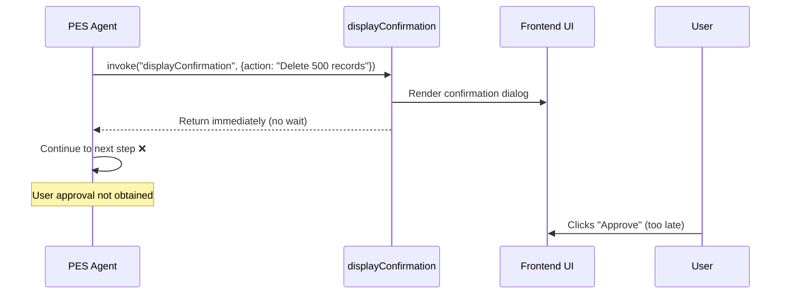
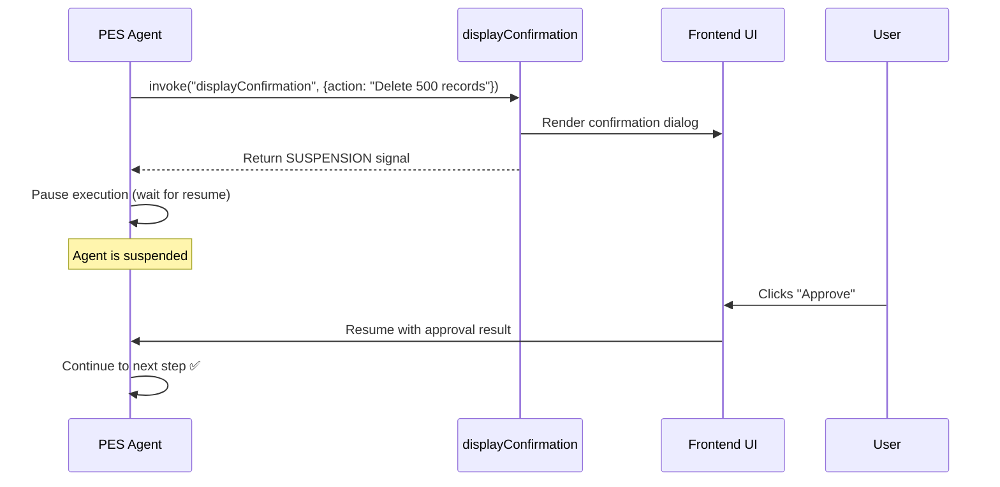

# ART Framework - Feature Request

## Blocking Tool Calls / Agent Suspension

**Date:** 2025-12-25  
**Requested By:** Zyntopia AgencyGen Frontend Team  
**Priority:** Medium  
**Category:** Agent Governance / Human-in-the-Loop (HITL)

---

## 1. Executive Summary

The Zyntopia frontend has implemented a `displayConfirmation` UI tool that renders approval dialogs for sensitive operations. However, the current ART Framework does not support **blocking tool calls** — when the agent invokes `displayConfirmation`, it immediately continues execution without waiting for user input.

This creates a **governance gap** where HITL approvals are cosmetic rather than functional.

---

## 2. Current Behavior (Problem)



**Impact:** The agent proceeds with sensitive actions before the user has a chance to approve or reject.

---

## 3. Desired Behavior



---

## 4. Technical Requirements

### 4.1 Tool Response Type: `BLOCKING`

Tools should be able to declare themselves as "blocking" via their schema:

```typescript
interface ToolSchema {
  name: string;
  description: string;
  parameters: ZodSchema;
  
  // NEW: Execution mode
  executionMode?: 'immediate' | 'blocking';
}
```

### 4.2 Suspension Signal

When a blocking tool is invoked, it should return a suspension signal:

```typescript
interface BlockingToolResult {
  type: 'SUSPENSION';
  suspensionId: string;      // Unique ID for this suspension
  resumePayload?: unknown;   // Data to include when resuming
  timeoutMs?: number;        // Optional: auto-reject after timeout
}
```

### 4.3 Resume API

The frontend needs an API to resume a suspended agent:

```typescript
// Resume a suspended agent with user decision
artInstance.resumeExecution(
  threadId: string,
  suspensionId: string,
  decision: {
    approved: boolean;
    reason?: string;
    modifiedArgs?: Record<string, unknown>;
  }
): Promise<void>
```

### 4.4 Observation Events

New observation types for suspension lifecycle:

```typescript
enum ObservationType {
  // Existing...
  
  // NEW
  AGENT_SUSPENDED = 'AGENT_SUSPENDED',    // Agent paused, waiting for input
  AGENT_RESUMED = 'AGENT_RESUMED',        // Agent resumed after user action
  SUSPENSION_TIMEOUT = 'SUSPENSION_TIMEOUT' // Auto-rejected due to timeout
}
```

---

## 5. Use Cases

### 5.1 Sensitive Data Operations
- Delete records
- Modify permissions
- Send external communications

### 5.2 Financial Actions
- Process payments
- Approve expenses
- Transfer funds

### 5.3 Compliance Gates
- Legal document generation
- Regulatory submission
- Audit trail creation

---

## 6. Alternative Approaches (Considered)

| Approach | Pros | Cons |
|----------|------|------|
| **Prompt Engineering** | No framework changes | Unreliable; agent may ignore |
| **Multi-Turn Conversation** | Uses existing flow | Breaks planning; awkward UX |
| **Framework Suspension** ✅ | Reliable; clean API | Requires framework changes |

**Recommendation:** Framework-level suspension is the only reliable solution.

---

## 7. Implementation Suggestions

### Phase 1: Core Suspension
1. Add `executionMode: 'blocking'` to tool schema
2. Implement suspension state in `PESAgent`
3. Add `resumeExecution()` to `ArtInstance`

### Phase 2: Timeout & Auto-Reject
1. Add configurable timeout per tool
2. Emit `SUSPENSION_TIMEOUT` observation
3. Allow default action on timeout (reject/approve)

### Phase 3: Suspension Persistence
1. Persist suspension state to storage adapter
2. Allow resume after page refresh
3. Support multi-device resume (e.g., approve on mobile)

---

## 8. Acceptance Criteria

- [ ] Tool can declare `executionMode: 'blocking'`
- [ ] Agent pauses after invoking blocking tool
- [ ] Frontend receives `AGENT_SUSPENDED` observation
- [ ] `resumeExecution()` API available on `ArtInstance`
- [ ] Agent continues after resume with decision payload
- [ ] Suspension state survives page refresh (optional Phase 3)

---

## 9. Questions for Framework Team

1. Is there existing suspension machinery in the agent loop we can extend?
2. Should suspension be step-level (single tool) or plan-level (entire execution)?
3. How should we handle nested/parallel suspensions?
4. What's the preferred storage format for suspension state?

---

## 10. Contact

**Frontend Team Lead:** [Your Name]  
**Repository:** `zyntopia-agencygen`  
**Related Issue:** Gap 2.3 in `AUDIT_AND_GAP_ANALYSIS.md`

---

*This document was generated as part of the ULTRATHINK audit protocol.*

---

## 11. Technical Proposal (Approved)

### 11.1 Core Architecture Changes

#### Tool Schema & Execution Signal
We will introduce an `executionMode` to the `ToolSchema` to allow tools to declare their behavior. Additionally, `ToolResult` will support a new `suspended` status.

- **`ToolSchema`**: Add `executionMode: 'immediate' | 'blocking'`.
- **`ToolResult`**: Add `status: 'suspended'`.

#### Suspension Lifecycle Observations
To enable the UI to react to agent suspension, we will add new `ObservationType` values:
- `AGENT_SUSPENDED`: Emitted when an agent pauses for HITL input.
- `AGENT_RESUMED`: Emitted when the agent resumes execution.
- `SUSPENSION_TIMEOUT`: Emitted if the suspension expires (Phase 2).

#### Persistent Suspension State
The `PESAgentStateData` will be extended to include a `suspension` context. This context captures the necessary information to resume the iteration loop.

```typescript
export interface PESAgentStateData {
    // ... existing fields
    suspension?: {
        suspensionId: string;
        itemId: string;           // The ID of the TodoItem currently being executed
        toolCall: ParsedToolCall; // The specific call that triggered suspension
        iterationState: ArtStandardPrompt; // Captured message history of the current iteration
    };
}
```

### 11.2 Implementation Details

#### Tool System Enhancement (`ToolSystem.ts`)
The `ToolSystem` will be updated to handle blocking tools:
1. When a tool is invoked, the `ToolSystem` checks the `executionMode` in the schema.
2. If `blocking`, the `ToolSystem` calls the executor.
3. The executor (e.g., `displayConfirmation`) performs any pre-processing and returns `status: 'suspended'` along with a `suspensionId`.
4. The `ToolSystem` stops executing any further tools in the current batch and returns the results.

#### PES Agent Loop Updates (`PESAgent.ts`)
The `_processTodoItem` loop is the heart of the execution. We will modify it to "yield" on suspension:
1. **Detection**: If a `ToolResult` with `status: 'suspended'` is encountered, the agent:
   - Records an `AGENT_SUSPENDED` observation.
   - Captures the current `messages` array (the iteration state).
   - Saves the suspension context to the persistent state via `StateManager`.
   - Returns a `status: 'wait'` signal to the outer loop.
2. **Graceful Exit**: The execution loop sees the `wait` status and terminates the current `process()` call, allowing the framework to return the current progress to the user.

#### New Resumption API (`ArtInstance.ts`)
We will add a `resumeExecution` method to the `ArtInstance` interface:

```typescript
art.resumeExecution(threadId, suspensionId, {
    approved: boolean,
    reason?: string,
    modifiedArgs?: any
});
```

**Resumption Flow:**
1. The method retrieves the suspended state from storage.
2. It validates the `suspensionId`.
3. It creates a `tool_result` message containing the user's decision.
4. It triggers a new `process()` cycle on the `PESAgent` with a `resume` flag.
5. `PESAgent` detects the `resume` flag, restores the captured `iterationState`, appends the user's decision, and continues the execution loop from the suspended step.

